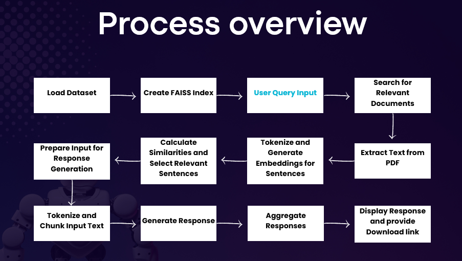

User Guide Repository Query System (private repository) with LLM

Our project, the User Guide Repository Query System, enhances the
capabilities of a pre-trained large language model (LLM) by integrating
it with a private dataset. This system processes user queries, retrieves
relevant information from user guides, and generates coherent,
contextually accurate responses.

Designed with different functions to ease:

-   PDF to text conversion

-   Data indexing (using FAISS)

-   Create embeddings (using a pretrained sentence transformer)

-   Text similarity search

-   Extract relevant sections (tokenizes relevant sentences based on
    cosine similarities)

-   Generates a response (using a pretrained lightweight GPT-2 model)

-   Creates a download link for documents

-   A comprehensive UI (based on streamlit)

Open Source Technologies Used:

-   Streamlit: Used for building the interactive web app.

-   Pandas: Used for data manipulation and analysis.

-   Torch: Used for various tensor operations and model inference.

-   Sentence Transformers: Used for obtaining sentence embeddings.

-   FAISS: A library for efficient similarity search and clustering of
    dense vectors.

-   NumPy: Used for numerical operations.

-   Transformers: Provides the tokenizer and model for generating
    responses.

-   PyPDF2: Used for reading text from PDF files.

-   NLTK: Used for tokenizing sentences.

##Contents:

-   guides: A private dataset directory containing different User
    Guides.

-   user_guides.csv: File that contains information about the User
    Guides.

-   app-guide-reference.py: Main code file.

##Data Collection and Preprocessing:

###<ins>FAISS Index Creation:</ins>

Converts textual data into numerical representations (embeddings) that
capture semantic meaning.

Process:

-   Load Model: Initialize the Sentence Transformer model
    (sentence-transformers/all-MiniLM-L6-v2).

-   Generate Embeddings: Encode each text document to produce
    high-dimensional embeddings.

Build an efficient similarity search index to enable quick retrieval of
relevant documents using FAISS (Facebook AI Similarity Search).

Process:

-   Prepare Embeddings: Collect embeddings for all documents.

-   Create Index: Initialize a FAISS index (IndexFlatL2).

-   Add Embeddings: Insert embeddings into the index for efficient
    search.

###<ins>Extracting Relevant Sections:</ins>

Identify and extract the most relevant sentences from the user guide
text that directly addresses the user query.

Process:

-   Tokenization: Break down the guide text into individual sentences,
    we used NLTK (Natural Language Toolkit).

-   Embedding Generation: Convert sentences and the user query into
    high-dimensional embeddings.

-   Similarity Calculation: Compute the similarity between the query
    embedding and each sentence embedding, we used PyTorch.

-   Top-K Selection: Identify and extract the top-K most relevant
    sentences based on similarity scores, we used PyTorch.

###<ins>Reading PDF Text:</ins>

Extracts textual content from user guide PDF files, making it accessible
for processing and analysis.

Process:

-   File Handling: Open and read the PDF file, we used PyPDF2
    (PdfReader).

-   Page Iteration: Traverse through each page of the PDF.

-   Text Extraction: Extract text content from each page.

-   Text Aggregation: Combine the extracted text into a single
    continuous text block.

##Setup and Installation:

Python 3.6 or greater.

The following libraries should be installed:

pip install streamlit pandas torch sentence-transformers faiss-cpu numpy
transformers PyPDF2 nltk 

##Usage:

Execute the script (a virtual environment is recommended):

streamlit run app-guide-reference.py
